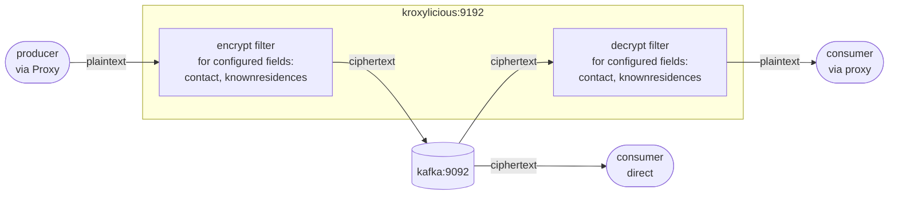

# Demo Scenario 1

This demo shows basic transparent field-level encryption and decryption at the Kafka proxy layer using [Kroxylicious](https://kroxylicious.io) together with the upcoming **Kryptonite for Kafka** proxy filter. No changes are required to producer or consumer applications since all cryptographic operations are handled transparently by within proxy by the respective filters.

---

## Scenario Overview

The stack consists of two containers:

| Container      | Image                                          | Role                                                         |
| -------------- | ---------------------------------------------- | ------------------------------------------------------------ |
| `kafka`        | `quay.io/strimzi/kafka:0.47.0-kafka-4.0.0`     | KRaft-mode single-node Kafka broker                          |
| `kroxylicious` | `hpgrahsl/kroxy-k4k-filter:beta7` | Kroxylicious proxy (0.20.0) with a snapshot build of the k4k filter |

### Data Flow



**Key insight:** Kroxylicious acts as a transparent proxy. Producers and consumers are pointed at Kroxylicious (`kroxylicious:9192`) instead of the brokers directly. The filter encrypts selected fields on the way in and decrypts them on the way out. As a consequence, the broker and any direct consumer bypassing the proxy only ever see ciphertext for the configured payload fields.

---

## Proxy Configuration

The proxy configuration for this demo scenario is here [proxy_config.yaml](proxy_config.yaml).

### Virtual Cluster

Kroxylicious exposes a virtual cluster (`demo-cluster`) that forwards all traffic to the real broker at `kafka:9092`. Clients connect to `kroxylicious:9192`.

### Filter Chain

Both the encryption and decryption filters are active as default filters on all traffic:

```yaml
defaultFilters:
  - k4k-encrypt
  - k4k-decrypt
```

This means:

- **Produce path**: records pass through the encryption filter where selected field values get encrypted and are replaced with the resulting ciphertext before being written to Kafka
- **Fetch path**: records pass through the decryption filter where ciphertext for selected fields are decrypted and replaced with the resulting plaintext before being delivered to the client

### Key Material

For this demo scenario only a single keyset is configured directly inline (`key_source: CONFIG`):

| Identifier | Algorithm      | Type                                          |
| ---------- | -------------- | --------------------------------------------- |
| `keyA`     | `TINK/AES_GCM` | Probabilistic AES-128-GCM (non-deterministic) |

It's the default key used for any encryption operations. You can find more information about the different options regarding [keyset management](https://hpgrahsl.github.io/kryptonite-for-kafka/dev/key-management/) and the [keyset tool](https://hpgrahsl.github.io/kryptonite-for-kafka/dev/keyset-tool/) in the Kryptonite for Kafka documentation.

### Topic Field Configuration

The filter applies to all topic names matching the pattern `demo-kroxy-k4k*`:

```yaml
topic_field_configs:
  - topic_pattern: demo-kroxy-k4k.*
    field_configs:
      - name: contact
        fieldMode: OBJECT
      - name: knownresidences
        fieldMode: ELEMENT
```

| Field             | Mode      | Behaviour                                                                   |
| ----------------- | --------- | --------------------------------------------------------------------------- |
| `contact`         | `OBJECT`  | The entire field value (a JSON object) is encrypted as a single opaque blob |
| `knownresidences` | `ELEMENT` | Each array element (individual address string) is encrypted separately      |

Payload fields not listed in the configuration are always passed through unchanged.

---

## Example: What Gets Encrypted

### Input Record (plaintext)

The first record from the sample dataset looks like this:

```json
{
  "_id": "6326f8ae077ea872f171e19b",
  "personal": {
    "firstname": "Rojas",
    "lastname": "Horn",
    "age": 39,
    "eyecolor": "gray",
    "gender": "male",
    "height": 161,
    "weight": 105
  },
  "isactive": false,
  "registered": "2022-07-05T03:47:06 -02:00",
  "contact": {
    "email": "rojashorn@genmom.com",
    "phone": "(845) 539-2580"
  },
  "knownresidences": [
    "798 Whitney Avenue, Homestead, Oklahoma, 54234",
    "856 Lafayette Avenue, Grandview, Arkansas, 15000",
    "860 Royce Place, Blodgett, Rhode Island, 6685",
    "468 Neptune Court, Beechmont, Louisiana, 19344"
  ]
}
```

### Encrypted Record (stored in Kafka / seen by direct consumer)

After passing through the encryption filter, `contact` is replaced by a single ciphertext string and each element of `knownresidences` is replaced by its own ciphertext string. All other fields are untouched:

```json
{
  "_id": "6326f8ae077ea872f171e19b",
  "personal": {
    "firstname": "Rojas",
    "lastname": "Horn",
    "age": 39,
    "eyecolor": "gray",
    "gender": "male",
    "height": 161,
    "weight": 105
  },
  "isactive": false,
  "registered": "2022-07-05T03:47:06 -02:00",
  "contact": "azIwMDAyBGtleUEBAAAD6JfVmpA35R7+llbZ/CFyjtnIzv9fjyVEmSAVKVlJTprEXh2h+8nK1RG2Z8hVas3E7xS72wFyAYAmjnnNR2gxCPlSqttJKj0788ov8IAupA==",
  "knownresidences": [
    "azIwMDAyBGtleUEBAAAD6Gg9t7DWy7LWgv5CCPwTTF5ui4E4HRWh1r2y751Uw1ZRlfsvIoy+gCfHZ9DVzylBtCC87d/3J4gdbtWOZNrvQdJxyHMTySwUfC8c5eM=",
    "azIwMDAyBGtleUEBAAAD6Px0vZ17TvJS49G0Rl14WJaMHGlC99cqQZopEbj0ecv8B5MfqukmyT90F49edy3wOv/pwixEE9sS/AdtHVSBFasJ47j6Al4q9lKdmUKgMg==",
    "azIwMDAyBGtleUEBAAAD6COXPJ1Cox4Ar8CFwcPkhf6BceZWVU3IaObIrY94cwlddkt9ATKEo0EsE91hhNZoDAjWQ16Lm3qJxyWmNFRCbHzmDt8+/Qi8Jiw+KA==",
    "azIwMDAyBGtleUEBAAAD6BEOQAMczpQ2TafYk/5K86fBaoY9/qVB6CzVCoSkloY22yg1JEBIROWzL70mrfUd6kRs5t36ozslaVzTRUZU9yMwHt7byK0KhALlvuk="
  ]
}
```

> **Note:** The ciphertext values are Base64-encoded strings and fully self-contained. This means any other [Kryptonite for Kafka](https://hpgrahsl.github.io/kryptonite-for-kafka/dev/) module is able to decrypt it provided it has access to the key material originally used for the encryption operations.

---

## Running the Demo

### 1. Start the stack

From the `./scenario_01/` directory:

```bash
docker compose up -d
```

This starts Kafka and Kroxylicious. Wait a few seconds for all services to be ready.

---

### 2. Produce records via the proxy (encrypted write)

The Kafka container already has the CLI tools, the sample data mounted at `/home/kafka/data/`, and the scripts mounted at `/home/kafka/scripts/`.

```bash
docker exec kafka /home/kafka/scripts/proxy_producer.sh
```

The producer talks to Kroxylicious to ingest the sample data (100 JSON records). The encryption filter intercepts each record, encrypts the `contact` field and each element of `knownresidences`, and forwards the modified records to the broker.

---

### 3. Consume directly from the broker (see ciphertext)

```bash
docker exec -it kafka /home/kafka/scripts/direct_consumer.sh
```

This bypasses the proxy entirely. You will see the partially encrypted form of the records exactly as stored in Kafka — `contact` is an opaque ciphertext string and each address in `knownresidences` is individually ciphered.

---

### 4. Consume via the proxy (see plaintext)

```bash
docker exec -it kafka /home/kafka/scripts/proxy_consumer.sh
```

The consumer talks to Kroxylicious. The decryption filter transparently decrypts all encrypted fields before delivering the records. The output is identical to the original plaintext input — as if no encryption ever happened.

---

### 5. Shut down

```bash
docker compose down
```
