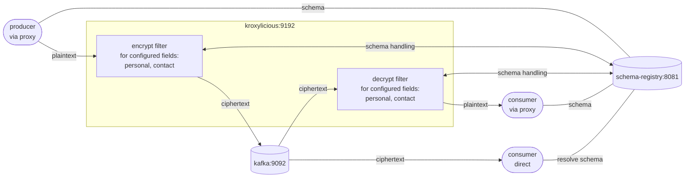

# Demo Scenario 2

This demo extends scenario 1 by adding a **Schema Registry** to the stack and switching the record format to **JSON_SR** (JSON with schema registry integration). It also introduces **two distinct keysets** in the proxy filter configuration, with different fields encrypted using different keys. As before, no changes are required to producer or consumer applications since all cryptographic operations are handled transparently at the proxy layer.

---

## Scenario Overview

The stack consists of three containers:

| Container         | Image                                              | Role                                                         |
| ----------------- | -------------------------------------------------- | ------------------------------------------------------------ |
| `kafka`           | `quay.io/strimzi/kafka:0.47.0-kafka-4.0.0`         | KRaft-mode single-node Kafka broker                          |
| `schema-registry` | `confluentinc/cp-schema-registry:7.9.0`            | Confluent Schema Registry for JSON Schema                    |
| `kroxylicious`    | `hpgrahsl/kroxy-k4k-filter:beta7`    | Kroxylicious proxy (0.20.0) with a snapshot build of the k4k filter |

### Data Flow



**Key insight:** Kroxylicious acts as a transparent proxy. Producers and consumers are pointed at Kroxylicious (`kroxylicious:9192`) instead of the brokers directly. The filter encrypts selected fields on the way in and decrypts them on the way out. As a consequence, the broker and any direct consumer bypassing the proxy only ever see ciphertext for the configured payload fields.

---

## Proxy Configuration

The proxy configuration for this demo scenario is here [proxy_config.yaml](proxy_config.yaml).

### Virtual Cluster

Kroxylicious exposes a virtual cluster (`demo-cluster`) that forwards all traffic to the real broker at `kafka:9092`. Clients connect to `kroxylicious:9192`.

### Filter Chain

Both the encryption and decryption filters are active as default filters on all traffic:

```yaml
defaultFilters:
  - k4k-encrypt
  - k4k-decrypt
```

This means:

- **Produce path**: records pass through the encryption filter where selected field values get encrypted and are replaced with the resulting ciphertext before being written to Kafka
- **Fetch path**: records pass through the decryption filter where ciphertext for selected fields are decrypted and replaced with the resulting plaintext before being delivered to the client

### Record Format

Both filters are configured with `record_format: JSON_SR` and point to the schema registry at `http://schema-registry:8081`. The schema mode is `DYNAMIC`, meaning the filter does all the necessary schema mutations on the fly as required by the configured field settings.

### Key Material

Two keysets are configured directly inline (`key_source: CONFIG`):

| Identifier | Algorithm      | Type                                          |
| ---------- | -------------- | --------------------------------------------- |
| `keyA`     | `TINK/AES_GCM` | Probabilistic AES-128-GCM (non-deterministic) |
| `keyB`     | `TINK/AES_GCM` | Probabilistic AES-256-GCM (non-deterministic) |

`keyA` is the default key used when no explicit `keyId` is specified in a field config. `keyB` is assigned explicitly to the `contact` field. You can find more information about the different options regarding [keyset management](https://hpgrahsl.github.io/kryptonite-for-kafka/dev/key-management/) and the [keyset tool](https://hpgrahsl.github.io/kryptonite-for-kafka/dev/keyset-tool/) in the Kryptonite for Kafka documentation.

### Topic Field Configuration

The filter applies to all topic names matching the pattern `demo-kroxy-k4k*`:

```yaml
topic_field_configs:
  - topic_pattern: demo-kroxy-k4k.*
    field_configs:
      - name: personal
        fieldMode: OBJECT
      - name: contact
        fieldMode: ELEMENT
        keyId: keyB
```

| Field      | Mode      | Key    | Behaviour                                                                        |
| ---------- | --------- | ------ | -------------------------------------------------------------------------------- |
| `personal` | `OBJECT`  | `keyA` | The entire field value (a JSON object) is encrypted as a single opaque blob      |
| `contact`  | `ELEMENT` | `keyB` | Each field value within the object is encrypted as an individual ciphertext      |

Payload fields not listed in the configuration are always passed through unchanged.

---

## Example: What Gets Encrypted

### Input Record (plaintext)

The first record from the sample dataset looks like this:

```json
{
  "_id": "6326f8ae077ea872f171e19b",
  "personal": {
    "firstname": "Rojas",
    "lastname": "Horn",
    "age": 39,
    "eyecolor": "gray",
    "gender": "male",
    "height": 161,
    "weight": 105
  },
  "isactive": false,
  "registered": "2022-07-05T03:47:06 -02:00",
  "contact": {
    "email": "rojashorn@genmom.com",
    "phone": "(845) 539-2580"
  },
  "knownresidences": [
    "798 Whitney Avenue, Homestead, Oklahoma, 54234",
    "856 Lafayette Avenue, Grandview, Arkansas, 15000",
    "860 Royce Place, Blodgett, Rhode Island, 6685",
    "468 Neptune Court, Beechmont, Louisiana, 19344"
  ]
}
```

### Encrypted Record (stored in Kafka / seen by direct consumer)

After passing through the encryption filter, `personal` is replaced by a single ciphertext string (encrypted with `keyA`) and each value within `contact` is replaced by its own ciphertext string (encrypted with `keyB`). All other fields are untouched:

```json
{
  "_id": "6326f8ae077ea872f171e19b",
  "personal": "azIwMDAyBGtleUEBAAAD6K83BzlSNda+8TZGEP3EFgBgjVEPI+i67oP6kWg6xm5rq9SlHuTa4UbASkeKynbywQLxBqnHEbV3oiMAdI+K+ng5b2Ww4Gnhz3FlSXteg1BKluQLBTdzu1E7OqxhpITjRmwPNY9YA8bNETvFEVasVGM=",
  "isactive": false,
  "registered": "2022-07-05T03:47:06 -02:00",
  "contact": {
    "email": "azIwMDAyBGtleUIBAAAD6TV483RLrTJFwf+Ysh74K+Tv8oQzTbN6qC0jorzlnyByjl05fGxLIkOSUeGi1IkQYHk=",
    "phone": "azIwMDAyBGtleUIBAAAD6fO1vJa78QSu7trM/0h3truWAu7r8Ym3N4uMzpW8AkfgymHNdiv3BnlTIt8="
  },
  "knownresidences": [
    "798 Whitney Avenue, Homestead, Oklahoma, 54234",
    "856 Lafayette Avenue, Grandview, Arkansas, 15000",
    "860 Royce Place, Blodgett, Rhode Island, 6685",
    "468 Neptune Court, Beechmont, Louisiana, 19344"
  ]
}
```

> **Note:** The ciphertext values are Base64-encoded strings and fully self-contained. This means any other [Kryptonite for Kafka](https://hpgrahsl.github.io/kryptonite-for-kafka/dev/) module is able to decrypt it provided it has access to the key material originally used for the encryption operations.

---

## Running the Demo

### 1. Start the stack

From the `./scenario_02/` directory:

```bash
docker compose up -d
```

This starts Kafka, Schema Registry, and Kroxylicious. Wait a few seconds for all services to be ready.

---

### 2. Produce records via the proxy (encrypted write)

The schema registry container has the Kafka CLI tools, the sample data mounted at `/home/appuser/data/`, and the scripts mounted at `/home/appuser/scripts/`.

```bash
docker exec schema-registry /home/appuser/scripts/proxy_producer.sh
```

The producer talks to Kroxylicious to ingest the sample data (100 JSON records) using the `kafka-json-schema-console-producer`. The encryption filter intercepts each record, encrypts the `personal` field with `keyA` and each element of `contact` with `keyB`, and forwards the modified records to the broker.

---

### 3. Consume directly from the broker (see ciphertext)

```bash
docker exec -it schema-registry /home/appuser/scripts/direct_consumer.sh
```

This bypasses the proxy entirely. You will see the partially encrypted form of the records exactly as stored in Kafka — `personal` is an opaque ciphertext string and each value within `contact` is individually ciphered.

---

### 4. Consume via the proxy (see plaintext)

```bash
docker exec -it schema-registry /home/appuser/scripts/proxy_consumer.sh
```

The consumer talks to Kroxylicious. The decryption filter transparently decrypts all encrypted fields before delivering the records. The output is identical to the original plaintext input — as if no encryption ever happened.

---

### 5. Shut down

```bash
docker compose down
```
