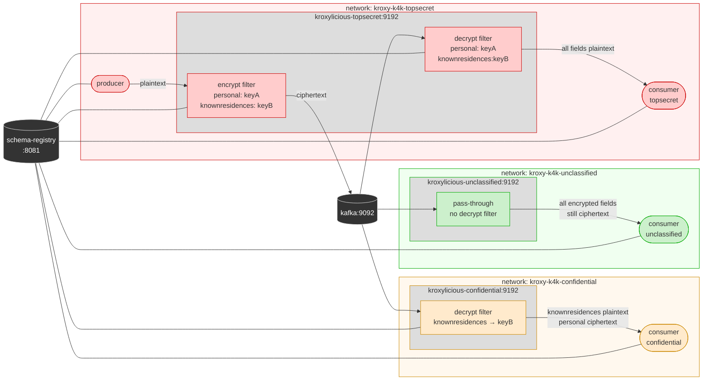

# Demo Scenario 3

This demo introduces **security clearance levels** enforced at the Kafka proxy layer. Three dedicated Kroxylicious instances are deployed (one per clearance level) each on its own isolated Docker network and configured with access only to the keysets its clearance level permits. Consuming clients are routed through the proxy instance that matches their clearance, which determines which encrypted payload fields they can see in plaintext. No changes are required to producer or consumer applications.

---

## Scenario Overview

The stack consists of five containers:

| Container                   | Image                                          | Role                                                                            |
| --------------------------- | ---------------------------------------------- | ------------------------------------------------------------------------------- |
| `kafka`                     | `quay.io/strimzi/kafka:0.51.0-kafka-4.2.0`     | KRaft-mode single-node Kafka broker                                             |
| `schema-registry`           | `confluentinc/cp-schema-registry:8.2.0`        | Confluent Schema Registry                                                        |
| `kroxylicious-unclassified` | `hpgrahsl/kroxylicious-kryptonite:0.20.0-0.1.0` | Kroxylicious proxy (0.20.0) with Kryptonite for Kafka filter (0.1.0)            |
| `kroxylicious-confidential` | `hpgrahsl/kroxylicious-kryptonite:0.20.0-0.1.0` | Kroxylicious proxy (0.20.0) with Kryptonite for Kafka filter (0.1.0)            |
| `kroxylicious-topsecret`    | `hpgrahsl/kroxylicious-kryptonite:0.20.0-0.1.0` | Kroxylicious proxy (0.20.0) with Kryptonite for Kafka filter (0.1.0)            |

### Network Isolation

Each Kroxylicious instance runs on its own dedicated Docker network. `kafka` and `schema-registry` are present on all three. A client container's network assignment determines which proxy it can reach and therefore which fields it can read in plaintext.

_NOTE: In real-world production settings you would ensure proper network isolation levels and put strict policies in place to make sure that clients are forcibly routed through the proxy that matches their security clearance level in order to avoid misuse and data leaks._

| Network                  | Members                                                 |
| ------------------------ | ------------------------------------------------------- |
| `kroxy-k4k-unclassified` | `kafka`, `schema-registry`, `kroxylicious-unclassified` |
| `kroxy-k4k-confidential` | `kafka`, `schema-registry`, `kroxylicious-confidential` |
| `kroxy-k4k-topsecret`    | `kafka`, `schema-registry`, `kroxylicious-topsecret`    |

### Data Flow



**Key insight:** In this example, network assignment is the implicit data access control boundary. A lower-clearance client physically should never be able to reach a higher-clearance proxy. The proxy enforces the clearance level by holding only the keysets permitted at that level. This means that a proxy running on confidential level by definition cannot decrypt topsecret fields, even if it tried.

_NOTE: In real-world production settings you would make use of centralized key management, e.g. by using a cloud KMS with fine-grained secret/key permissions such that any proxy instance can only interact with keysets it's allowed to use depending on the security clearance level it's supposed to operate with._

---

## Proxy Configuration

The proxy configurations for this demo scenario are in [proxy_config_unclassified.yaml](proxy_config_unclassified.yaml), [proxy_config_confidential.yaml](proxy_config_confidential.yaml), and [proxy_config_topsecret.yaml](proxy_config_topsecret.yaml).

### Filter Configuration per Clearance Level

| Proxy instance              | Encrypt filter          | Decrypt filter             | Keys available  |
| --------------------------- | ----------------------- | -------------------------- | --------------- |
| `kroxylicious-unclassified` | —                       | —                          | none            |
| `kroxylicious-confidential` | —                       | `k4k-decrypt-confidential` | `keyB` only     |
| `kroxylicious-topsecret`    | `k4k-encrypt-topsecret` | `k4k-decrypt-topsecret`    | `keyA` + `keyB` |

The encryption filter is only deployed on the topsecret proxy. Producers are routed through it so that records are written to Kafka with all sensitive fields encrypted. All filters are configured with `record_format: JSON_SR` and `schema_mode: DYNAMIC`.

### Key Material

Two keysets are configured inline (`key_source: CONFIG`):

| Identifier | Algorithm      | Clearance level | Type                                          |
| ---------- | -------------- | --------------- | --------------------------------------------- |
| `keyA`     | `TINK/AES_GCM` | topsecret       | Probabilistic AES-128-GCM (non-deterministic) |
| `keyB`     | `TINK/AES_GCM` | confidential    | Probabilistic AES-256-GCM (non-deterministic) |

In a production setup, keyset access would be governed by a KMS with per-instance permissions rather than inline key material. You can find more information about [keyset management](https://hpgrahsl.github.io/kryptonite-for-kafka/dev/key-management/) and the [keyset tool](https://hpgrahsl.github.io/kryptonite-for-kafka/dev/keyset-tool/) in the Kryptonite for Kafka documentation.

### Topic Field Configuration

The encrypt and decrypt filters on the topsecret proxy are configured for topics matching `demo-kroxy-k4k*`:

```yaml
topic_field_configs:
  - topic_pattern: demo-kroxy-k4k.*
    field_configs:
      - name: personal
        fieldMode: ELEMENT
        keyId: keyA
      - name: knownresidences
        fieldMode: OBJECT
        keyId: keyB
```

| Field             | Mode      | Key    | Clearance required to decrypt |
| ----------------- | --------- | ------ | ----------------------------- |
| `personal`        | `ELEMENT` | `keyA` | topsecret                     |
| `knownresidences` | `OBJECT`  | `keyB` | confidential or above         |

The confidential proxy only has `keyB` and only lists `knownresidences` in its field config — it cannot decrypt `personal` regardless. The unclassified proxy has no decrypt filter at all.

Payload fields not listed in the configuration are always passed through unchanged.

---

## Example: What Each Clearance Level Sees

### unclassified — all encrypted fields remain ciphertext

```json
{
  "_id": "6326f8ae077ea872f171e19b",
  "personal": {
    "firstname": "azIwMDAyBGtleUEBAAAD6BTEB3M3YobS3/1fQ/QhuzxtfR1IepP95zse1+5feIuZ7xQ=",
    "lastname": "azIwMDAyBGtleUEBAAAD6ImHTspaknDwNuHylKxkjEwz4tjPEFS5gIAo+5Qv7IZVZA==",
    "age": "azIwMDAyBGtleUEBAAAD6NPngSeNyLIqnXyGdIJOwHRRgucVnlYnNBsmEFYEVA==",
    "eyecolor": "azIwMDAyBGtleUEBAAAD6Ai9ND9E2nLFsq7Yj4UfbiFq7zAHineYjnReexH59Owgfw==",
    "gender": "azIwMDAyBGtleUEBAAAD6AJsTFHIcq2ShTwkbM80UmQUcK0Loljs9rErNen4qPsL9Q==",
    "height": "azIwMDAyBGtleUEBAAAD6IubUy8x5VN8cuiH2zm5WEBxOK469n6eXnWgjT9YNow=",
    "weight": "azIwMDAyBGtleUEBAAAD6ExaH1nHGJzJdKy1G75wTcJp4WmSijLVUORkybbPGE0="
  },
  "isactive": false,
  "registered": "2022-07-05T03:47:06 -02:00",
  "contact": { "email": "rojashorn@genmom.com", "phone": "(845) 539-2580" },
  "knownresidences": "azIwMDAyBGtleUIBAAAD6d+F13v5uVB4XBPE3yBwlKESmuVEuZV8c0JWOvLQufFBvb2ltA+nspnQVMOU5xNuojTRBWOpnDJh7nFVCT/+c5VWc3n7PyLcJ+6xD8XUon0kXO6iroOr0U5HzO3VfLvSCuSUxThNoVL80W9rEicHuO0b6sIh4WHXJ4sqHWpKb91BJ44p8rkIYi2jl31872Uv033gTCrcKsxmzV8MVFkUEBFVRWj9Hl8V4fjHvqKP/PhF6thxtJbSPMsf5ShPvn15lP4C3SHmshxYReISsRBqlPkaU+HvIpMRGvxm4hRV"
}
```

### confidential — `knownresidences` decrypted, `personal` still ciphertext

```json
{
  "_id": "6326f8ae077ea872f171e19b",
  "personal": {
    "firstname": "azIwMDAyBGtleUEBAAAD6MAiKkxjFYZ/UdstZIwL+QzU23pYDoPe9oy0vX8Yhx4hjc8=",
    "lastname": "azIwMDAyBGtleUEBAAAD6BhGt2pUcQj5tt/d60Op0dA2OQ3F+edvBIrBTn/X8eCu6w==",
    "age": "azIwMDAyBGtleUEBAAAD6EZ0eJh85uawcM4+wg3hgf0wgxa9eCaQVsWHEDGpFw==",
    "eyecolor": "azIwMDAyBGtleUEBAAAD6E5XD9U90PqHEh2uWMHIk7OAUrWM7r2f1jUkDVyMEVbW+w==",
    "gender": "azIwMDAyBGtleUEBAAAD6O1Wf0YBZbPWscbAa6MV1iHTu52qeCFgd1FjxMzc6g+FlA==",
    "height": "azIwMDAyBGtleUEBAAAD6JBiG3cfOhV2mUyB0/T2aUpFM5DuogQtMH1WUg+Vn+w=",
    "weight": "azIwMDAyBGtleUEBAAAD6FRepFBwdyvD/RrBVZ2czIUcs5X7vnz1RcWtnvo2jeM="
  },
  "isactive": false,
  "registered": "2022-07-05T03:47:06 -02:00",
  "contact": { "email": "rojashorn@genmom.com", "phone": "(845) 539-2580" },
  "knownresidences": [
    "798 Whitney Avenue, Homestead, Oklahoma, 54234",
    "856 Lafayette Avenue, Grandview, Arkansas, 15000",
    "860 Royce Place, Blodgett, Rhode Island, 6685",
    "468 Neptune Court, Beechmont, Louisiana, 19344"
  ]
}
```

### topsecret — all fields decrypted

```json
{
  "_id": "6326f8ae077ea872f171e19b",
  "personal": {
    "firstname": "Rojas",
    "lastname": "Horn",
    "age": 39,
    "eyecolor": "gray",
    "gender": "male",
    "height": 161,
    "weight": 105
  },
  "isactive": false,
  "registered": "2022-07-05T03:47:06 -02:00",
  "contact": { "email": "rojashorn@genmom.com", "phone": "(845) 539-2580" },
  "knownresidences": [
    "798 Whitney Avenue, Homestead, Oklahoma, 54234",
    "856 Lafayette Avenue, Grandview, Arkansas, 15000",
    "860 Royce Place, Blodgett, Rhode Island, 6685",
    "468 Neptune Court, Beechmont, Louisiana, 19344"
  ]
}
```

> **Note:** The ciphertext values are Base64-encoded strings and fully self-contained. Any other [Kryptonite for Kafka](https://hpgrahsl.github.io/kryptonite-for-kafka/dev/) module can decrypt them provided it has access to the key material originally used for encryption.

---

## Running the Demo

### 1. Start the stack

From the `scenario_03/` directory:

```bash
docker compose up -d
```

This starts Kafka, Schema Registry, and all three Kroxylicious proxy instances. Wait a few seconds for all services to be ready.

---

### 2. Produce records via the topsecret proxy (encrypted write)

The producer runs as an ephemeral container on the `kroxy-k4k-topsecret` network, routing it through `kroxylicious-topsecret` where the encryption filter has access to all key material:

```bash
docker run --rm --name app-producer \
  --network kroxy-k4k-topsecret \
  -v ../data/:/home/appuser/data/ \
  -v ./scripts/:/home/appuser/scripts/ \
  confluentinc/cp-schema-registry:8.2.0 \
  /home/appuser/scripts/proxy_producer.sh
```

The encryption filter intercepts each record, encrypts each field in `personal` with `keyA` (topsecret level) and the entire `knownresidences` value with `keyB` (confidential level), and forwards the modified records to the broker.

---

### 3. Consume at unclassified clearance

Placing the container on `kroxy-k4k-unclassified` routes it through `kroxylicious-unclassified`, which has no decryption filter. All encrypted fields are delivered as ciphertext:

```bash
docker run -it --rm --name app-consumer-unclassified \
  --network kroxy-k4k-unclassified \
  -v ./scripts/:/home/appuser/scripts/ \
  confluentinc/cp-schema-registry:8.2.0 \
  /home/appuser/scripts/proxy_consumer.sh unclassified
```

---

### 4. Consume at confidential clearance

Placing the container on `kroxy-k4k-confidential` routes it through `kroxylicious-confidential`. The decryption filter has `keyB` only, so `knownresidences` is decrypted but `personal` remains ciphertext:

```bash
docker run --rm --name app-consumer-confidential \
  --network kroxy-k4k-confidential \
  -v ./scripts/:/home/appuser/scripts/ \
  confluentinc/cp-schema-registry:8.2.0 \
  /home/appuser/scripts/proxy_consumer.sh confidential
```

---

### 5. Consume at topsecret clearance

Placing the container on `kroxy-k4k-topsecret` routes it through `kroxylicious-topsecret`. The decryption filter has both `keyA` and `keyB`, so all encrypted fields are fully decrypted:

```bash
docker run --rm --name app-consumer-topsecret \
  --network kroxy-k4k-topsecret \
  -v ./scripts/:/home/appuser/scripts/ \
  confluentinc/cp-schema-registry:8.2.0 \
  /home/appuser/scripts/proxy_consumer.sh topsecret
```

---

### 6. Shut down

```bash
docker compose down
```
