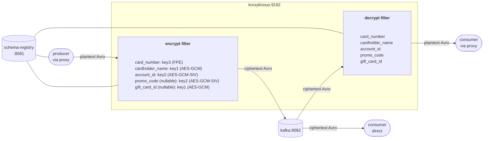

# Demo Scenario 4

Fictional checkout events are published to a Kafka topic. A direct consumer from that topic should be able to correlate transactions by account id but must never see plaintext account IDs during processing. Additionally, nullable fields like `promo_code` and `gift_card_id` are deemed commercially sensitive which means the fact whether or not a promotion or a gift card was applied to a transaction should not be detectable in partially encrypted topic data. This demo shows how the proxy filter can satisfy all these requirements at once.

---

## Scenario Overview

The stack consists of three containers:

| Container         | Image                                      | Role                                        |
| ----------------- | ------------------------------------------ | ------------------------------------------- |
| `kafka`           | `quay.io/strimzi/kafka:0.51.0-kafka-4.2.0` | KRaft-mode single-node Kafka broker         |
| `schema-registry` | `confluentinc/cp-schema-registry:8.2.0`    | Confluent Schema Registry                    |
| `kroxylicious`    | `hpgrahsl/kroxylicious-kryptonite:0.20.0-0.1.0`          | Kroxylicious proxy (0.20.0) with Kryptonite for Kafka filter (0.1.0) |

### Data Flow



**Key insight:** The filter encrypts the five sensitive fields on the way in and decrypts them on the way out with individual configurations to achieve field-specific semantics. While a direct consumer bypassing the proxy only ever sees ciphertext for the configured fields.

---

## Proxy Configuration

The proxy configuration for this demo scenario is here [proxy_config.yaml](proxy_config.yaml).

### Virtual Cluster

Kroxylicious exposes a virtual cluster (`demo-cluster`) that forwards all traffic to the real broker at `kafka:9092`. Clients connect to `kroxylicious:9192`.

### Filter Chain

Both the encryption and decryption filters are active as default filters on all traffic:

```yaml
defaultFilters:
  - k4k-encrypt
  - k4k-decrypt
```

- **Produce path**: records pass through the encryption filter; selected field values are encrypted and replaced with ciphertext before being written to Kafka.
- **Fetch path**: records pass through the decryption filter; ciphertext for selected fields is decrypted and replaced with plaintext before delivery to the client.

### Record Format

Both filters are configured with `record_format: AVRO` and point to the schema registry at `http://schema-registry:8081`. The schema mode is `DYNAMIC`, meaning the filter performs all necessary schema mutations on the fly as required by the configured field settings.

### Key Material

Three keysets are configured inline (`key_source: CONFIG`), each serving a different encryption mode:

| Identifier | Algorithm                | Mode              | Used for                          |
| ---------- | ------------------------ | ----------------- | --------------------------------- |
| `key1`     | `TINK/AES_GCM`           | Probabilistic     | `cardholder_name`, `gift_card_id` |
| `key2`     | `TINK/AES_GCM_SIV`       | Deterministic     | `account_id`, `promo_code`        |
| `key3`     | `CUSTOM/MYSTO_FPE_FF3_1` | Format-Preserving | `card_number`                     |

`key1` is the default key (`cipher_data_key_identifier: key1`). Fields using a different key reference it explicitly via `keyId` in the respective field configuration. You can find more information about [keyset management](https://hpgrahsl.github.io/kryptonite-for-kafka/dev/key-management/) and the [keyset tool](https://hpgrahsl.github.io/kryptonite-for-kafka/dev/keyset-tool/) in the Kryptonite for Kafka documentation.

### Topic Field Configuration

The filter applies to all topic names matching the pattern `demo-kroxy-k4k-.*`:

```yaml
      topic_field_configs:
        - topic_pattern: demo-kroxy-k4k-.*
          field_configs:
            - name: card_number
              keyId: key3
              algorithm: CUSTOM/MYSTO_FPE_FF3_1
              fpeAlphabetType: DIGITS
            - name: cardholder_name
            - name: account_id
              keyId: key2
              algorithm: TINK/AES_GCM_SIV
            - name: promo_code
              keyId: key2
              algorithm: TINK/AES_GCM_SIV
            - name: gift_card_id
```

| Field             | `keyId`          | Nullable | Notes                                                                                                               |
| ----------------- | ---------------- | -------- | ------------------------------------------------------------------------------------------------------------------- |
| `card_number`     | `key3`           | no       | FPE; output is still a 16-digit digit string; FPE cannot encrypt null                                               |
| `cardholder_name` | `key1` (default) | no       | Probabilistic; base64 ciphertext, fully randomised                                                                  |
| `account_id`      | `key2`           | no       | Deterministic; identical input always produces identical output                                                     |
| `promo_code`      | `key2`           | yes      | Deterministic + null encryption; same promo code always produces the same ciphertext; null also produces ciphertext |
| `gift_card_id`    | `key1` (default) | yes      | Probabilistic + null encryption; null also produces ciphertext                                                      |

Payload fields not listed in the configuration are always passed through unchanged.

---

## Spotlight: Three Modes, One Record

This scenario uses three distinct encryption modes simultaneously on fields of the same record. Here is how they differ:

| Mode                  | Algorithm                | Ciphertext looks like                      | Same input → same output? | Use case                                                              |
| --------------------- | ------------------------ | ------------------------------------------ | ------------------------- | --------------------------------------------------------------------- |
| **Probabilistic**     | `TINK/AES_GCM`           | Base64 string                              | No                        | Full confidentiality; no leakage                                      |
| **Deterministic**     | `TINK/AES_GCM_SIV`       | Base64 string                              | Yes                       | Analytics / correlation without decryption                            |
| **Format-Preserving** | `CUSTOM/MYSTO_FPE_FF3_1` | same alphabet, same length (here `DIGITS`) | Yes                       | Storage systems that require the original character format and length |

Deterministic encryption is used for both `account_id` and `promo_code`. An analytics pipeline can group and correlate records by `account_id` ciphertext without ever needing the original value. Similarly, someone with direct access only to the broker could count how many transactions used each promo code without knowing which code was actually used.

### Examples `account_id`:

* `ACC-88901` account id has 20 appearances across all 1000 plaintext sample records. It encrypts to `azIwMTAzBGtleTIBAAAnEC4hwqBrEya+Oyzk25lHEyBi1wFZVJuOr893B3MRDWL6/aJoCNvs` every time.

* `ACC-44891` account id has 60 appearances across all 1000 plaintext sample records. It encrypts to `azIwMTAzBGtleTIBAAAnEB3WxuK/wVbq8dOS7wWm/VCN5QzY1xPnm4Ee9RYADEGZw/EUk70W` every time.

### Examples `promo_code`:

* `LOYALTY20` promo code has 76 appearances across all 1000 plaintext sample records. It encrypts to `azIwMTAzBGtleTIBAAAnEFs9uXml+R0BdyZzBjsA7Euk/9241I8s1BudyogVdte5hsgLLjVWccOlAfh+e11bEQ==` every time.

* `WELCOME10` promo code has 82 appearances across all 1000 plaintext sample records. It encrypts to `azIwMTAzBGtleTIBAAAnEBvwUyVe5dv8BhjHJUh5AQMr00C501tCTMWMpS6DzlBYZGF5CxO+6DqQWXxra/Pyyg==` every time.

Both `promo_code` and `gift_card_id` are Avro union types `["null", "string"]`. The proxy filter encrypts null inputs just like non-null ones which means the direct consumer sees ciphertext regardless of whether the field had a value or not. Null encryption only works with non-FPE ciphers. Since FPE operates on characters from a defined alphabet, there is simply nothing to encrypt for FPE when the input is null. Therefore null values must pass through untouched in this case.

---

## Example: What Gets Encrypted

### Input Record (plaintext)

```json
{
  "transaction_id": "TXN-0001",
  "timestamp_utc": "2025-09-23T05:25:57Z",
  "merchant_id": "M-1093",
  "merchant_name": "Delta Air Lines",
  "merchant_category": "Travel",
  "amount_usd": 1499.36,
  "currency": "CAD",
  "card_number": "4556737886310757",
  "cardholder_name": "Fatima Al-Hassan",
  "account_id": "ACC-88901",
  "billing_zip": "10001",
  "promo_code": { "string": "LOYALTY20" },
  "gift_card_id": { "string": "GC-70465583" }
}
```

### Encrypted Record (stored in Kafka / seen by direct consumer)

After passing through the encryption filter, the five sensitive fields are encrypted. All other fields in this example are deemed non-sensitive and stored in plaintext exactly as produced:

```json
{
  "transaction_id": "TXN-0001",
  "timestamp_utc": "2025-09-23T05:25:57Z",
  "merchant_id": "M-1093",
  "merchant_name": "Delta Air Lines",
  "merchant_category": "Travel",
  "amount_usd": 1499.36,
  "currency": "CAD",
  "card_number": "5394198620483588",
  "cardholder_name": "azIwMTAyBGtleTEBAAAnEBno9eY0b+RpxgAV9E72gdagJpo2olhoqIUMH+Nz/MS/ut72ZMxssiE9VRhuLCbtRBq1jSUF5fLv+A==",
  "account_id": "azIwMTAzBGtleTIBAAAnEC4hwqBrEya+Oyzk25lHEyBi1wFZVJuOr893B3MRDWL6/aJoCNvs",
  "billing_zip": "10001",
  "promo_code": {
    "string": "azIwMTAzBGtleTIBAAAnEFs9uXml+R0BdyZzBjsA7Euk/9241I8s1BudyogVdte5hsgLLjVWccOlAfh+e11bEQ=="
  },
  "gift_card_id": {
    "string": "azIwMTAyBGtleTEBAAAnEOiKZJmRozSXF2SS7DN+yU9diTtTEoP9pWX78OZssx+SrpqhYlFzXNbSeCcZrNsyfA4Kl3lOutCAbcinA9Zn"
  }
}
```

Field by field:

- **`card_number`:** replaced by a 16-digit digit string via FPE. The ciphertext is still all-digits and the same length as the original, so legacy storage schemas or downstream systems with a strict digit-string column type can store it without any schema changes.
- **`cardholder_name`:** replaced by a probabilistic AES-GCM ciphertext. The same name produces a different ciphertext for every encryption operation.
- **`account_id`:** replaced by a deterministic AES-SIV ciphertext. The same account ID always encrypts to the same value, enabling `GROUP BY` correlation or `JOIN` operations directly on encrypted data.
- **`promo_code`:** deterministic AES-GCM-SIV produces ciphertext even for null input. The direct consumer cannot tell whether or not a record had a promo code applied. When the value is non-null (e.g. `"FALL25"`), all records with that same promo code will purposefully carry the identical ciphertext.
- **`gift_card_id`:** replaced by a probabilistic AES-GCM ciphertext. Null values also get encrypted which means the presence or absence of a gift card is hidden from anyone without key access.

---

## Running the Demo

### 1. Start the stack

From the `./scenario_04/` directory:

```bash
docker compose up -d
```

This starts Kafka, Schema Registry, and Kroxylicious. Wait a few seconds for all services to be ready.

---

### 2. Produce records via the proxy (encrypted write)

The schema registry container includes the Confluent Kafka CLI tools, with sample data mounted at `/home/appuser/data/` and scripts at `/home/appuser/scripts/`.

```bash
docker exec schema-registry /home/appuser/scripts/proxy_producer.sh
```

The producer talks to Kroxylicious and ingests 1000 Avro records using `kafka-avro-console-producer`. The encryption filter intercepts each record, encrypts the five sensitive fields with the configured keys and algorithms, and forwards the modified records to the broker.

---

### 3. Consume directly from the broker (see ciphertext)

```bash
docker exec -it schema-registry /home/appuser/scripts/direct_consumer.sh
```

This bypasses the proxy entirely. You will see the records exactly as stored in Kafka which means the values for all five sensitive fields are all ciphertext.

---

### 4. Consume via the proxy (see plaintext)

```bash
docker exec -it schema-registry /home/appuser/scripts/proxy_consumer.sh
```

The consumer talks to Kroxylicious. The decryption filter transparently decrypts all encrypted fields before delivery. The output is identical to the original plaintext input.

---

### 5. Shut down

```bash
docker compose down
```

---

## Note on Avro Tooling

Previous scenarios use `kafka-json-schema-console-producer` and `kafka-json-schema-console-consumer` for JSON Schema records. This scenario switches to `kafka-avro-console-producer` and `kafka-avro-console-consumer`, both available in the `cp-schema-registry` image. The data file (`checkout_events.jsonl`) is still JSON-per-line — `kafka-avro-console-producer` reads JSON-encoded Avro records from stdin and serialises them against the registered schema, so no binary Avro encoding of the source data is required.
