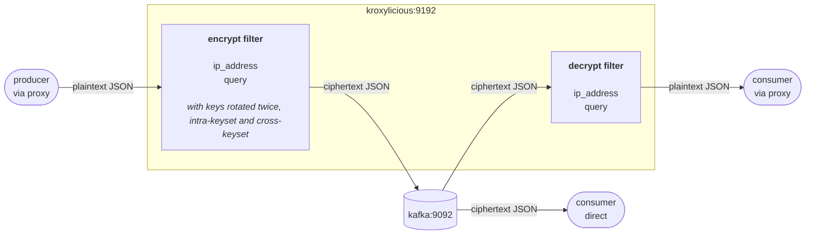

# Demo Scenario 5

A Kafka topic accumulates partially encrypted search query log records over time. This demo shows that when the encryption key is rotated, every record in the topic, regardless of which key encrypted it, continues to decrypt correctly at the proxy. Key rotation can be achieved either by choosing a different key id within the same keyset ("intra-keyset rotation") or by switching over to an entirely new keyset ("cross-keyset rotation").

---

## Scenario Overview

The stack is intentionally minimal to focuse on the key rotation aspect. There is no schema registry in use. The sample records are plain JSON, hence, the filter is configured with `record_format: JSON`.

| Container      | Image                                      | Role                                        |
| -------------- | ------------------------------------------ | ------------------------------------------- |
| `kafka`        | `quay.io/strimzi/kafka:0.51.0-kafka-4.2.0` | KRaft-mode single-node Kafka broker         |
| `kroxylicious` | `hpgrahsl/kroxylicious-kryptonite:0.20.0-0.1.0`          | Kroxylicious proxy (0.20.0) with Kryptonite for Kafka filter (0.1.0) |

### Data Flow



---

## Demo Phases

The demo runs in three sequential phases. Each phase ingests `100` search query log records into the same topic (`demo-kroxy-k4k-rotation`), always encrypting the same two fields (`ip_address`, `query`). Only the active default keyset and its designated key id change between phases.

| Phase | Config file                | Active keyset | Primary key ID | Records produced |
| ----- | -------------------------- | ------------- | -------------- | ---------------- |
| 1     | `proxy_config_phase1.yaml` | `keyset_1`    | `10000`        | 100              |
| 2     | `proxy_config_phase2.yaml` | `keyset_1`    | `10001`        | 100              |
| 3     | `proxy_config_phase3.yaml` | `keyset_2`    | `10003`        | 100              |

After all three phases the topic holds `300` records encrypted under three different keys. A single `consume_proxy.sh` call decrypts all `300` correctly.

---

## Proxy Configuration

The proxy configuration for each phase is in the corresponding file:

- [proxy_config_phase1.yaml](proxy_config_phase1.yaml)
- [proxy_config_phase2.yaml](proxy_config_phase2.yaml)
- [proxy_config_phase3.yaml](proxy_config_phase3.yaml)

`proxy_config.yaml` (what Docker Compose mounts) starts as a copy of `proxy_config_phase1.yaml`. You replace its content with the next phase config and restart Kroxylicious to advance to the next phase of the demo.

### Virtual Cluster

Kroxylicious exposes a virtual cluster (`demo-cluster`) that forwards all traffic to the real broker at `kafka:9092`. Clients connect to `kroxylicious:9192`.

### Filter Chain

```yaml
defaultFilters:
  - k4k-encrypt
  - k4k-decrypt
```

Both filters are active on all traffic. The encrypt filter runs on the produce path; the decrypt filter runs on the fetch path.

### Record Format

Both filters use `record_format: JSON`. No schema registry is required.

### Key Material

Both keysets, `keyset_1` (key IDs 10000, 10001, 10002) and `keyset_2` (key IDs 10003, 10004, 10005), are present in every phase config. What changes across phases is which keyset is the active default (`cipher_data_key_identifier`) and which key within that keyset is the primary (`primaryKeyId`).

| Phase | Active keyset | Primary key ID | Keysets available for decryption                                   |
| ----- | ------------- | -------------- | ------------------------------------------------------------------ |
| 1     | `keyset_1`    | `10000`        | `keyset_1` (10000, 10001, 10002), `keyset_2` (10003, 10004, 10005) |
| 2     | `keyset_1`    | `10001`        | `keyset_1` (10000, 10001, 10002), `keyset_2` (10003, 10004, 10005) |
| 3     | `keyset_2`    | `10003`        | `keyset_1` (10000, 10001, 10002), `keyset_2` (10003, 10004, 10005) |

### Topic Field Configuration

The filter applies to all topic names matching `demo-kroxy-k4k-rotation*`:

```yaml
topic_field_configs:
  - topic_pattern: demo-kroxy-k4k-rotation*
    field_configs:
      - name: ip_address
      - name: query
```

Both fields use the default keyset and algorithm (`cipher_data_key_identifier` / `cipher_algorithm`) in each phase. No per-field key overrides are exercised in this example, although it would work in the same way.

---

## Spotlight: How Self-Describing Ciphertext Enables Key Rotation

Every encrypted field based on non-FPE ciphers is effectively self-contained, which allows:

1. to derive the specific key id within a Tink keyset used during encryption
   - **intra-keyset rotation** (shown in demo phase 2): promoting key id `10001` to primary within `keyset_1` means new records are encrypted with key id `10001`. Old records encrypted with key id `10000` still decrypt correctly so long key id `10000` remains in the keyset.

2. to infer the keyset originally used during encryption
   - **Cross-keyset rotation** (shown in demo phase 3): switching the default to `keyset_2` means new records carry `keyset_2` in the meta data of each encrypted field. Old records carry `keyset_1` and still allow the decrypt filter to correctly decrypt the data given `keyset_1` is still accessible at that time.

---

## Example: What Gets Encrypted

### Input Record (plaintext)

```json
{
  "log_id": "P1-Q0001",
  "timestamp": "2025-01-15T06:00:37Z",
  "ip_address": "203.0.113.8",
  "query": "tink cryptography library",
  "num_results": 125,
  "response_time_ms": 19,
  "user_agent": "Mozilla/5.0 (Windows NT 10.0; Win64; x64) AppleWebKit/537.36"
}
```

### Encrypted Record — stored in Kafka / seen by direct consumer

```json
{
  "log_id": "P1-Q0001",
  "timestamp": "2025-01-15T06:00:37Z",
  "ip_address": "azIwMDAyCGtleXNldF8xAQAAJxB1okTBufgJQ4SrQdXVmhyu0pwSbHMsh68xjc9/gS6gOh7bKyiT6EAF",
  "query": "azIwMDAyCGtleXNldF8xAQAAJxDXTZh2XSuyJOlPKZGU0KmFYb7r07NJem99/t10/oGPaRXODOXVsPa3u5yQVt3tDxua1xvqN5U=",
  "num_results": 125,
  "response_time_ms": 19,
  "user_agent": "Mozilla/5.0 (Windows NT 10.0; Win64; x64) AppleWebKit/537.36"
}
```

### Decrypted Record — via proxy

```json
{
  "log_id": "P1-Q0001",
  "timestamp": "2025-01-15T06:00:37Z",
  "ip_address": "203.0.113.8",
  "query": "tink cryptography library",
  "num_results": 125,
  "response_time_ms": 19,
  "user_agent": "Mozilla/5.0 (Windows NT 10.0; Win64; x64) AppleWebKit/537.36"
}
```

---

## Running the Demo

Run all the following commands from within the `./scenario_05/` folder.

Before starting the stack, copy the proxy configuration for phase 1 as the currently active config:

```bash
cp proxy_config_phase1.yaml proxy_config.yaml
```

This configuration instructs the proxy filter to work with:

- `TINK/AES_GCM` as the default cipher algorithm
- `keyset_1` as the default keyset using key id `10000` (current primary key)

for encrypting the two fields `ip_address` and `query`.

---

### 1. Start the Stack

```bash
docker compose up -d
```

---

### 2. Produce First Batch of Records (Phase 1)

Produce the first batch of `100` query log JSON records:

```bash
docker exec kafka /home/kafka/scripts/produce_proxy.sh /home/kafka/data/querylogs_phase1.jsonl
```

The proxy filter encrypts them with `keyset_1` and key id `10000` according to the currently active configuration for phase 1 ingestion.

---

### 4. Verify Partially Encrypted Data

Consume the records directly from the Kafka topic to see the partially encrypted records:

```bash
docker exec kafka /home/kafka/scripts/consume_direct.sh 100
```

The `ip_address` and `query` fields are ciphertext in every record. All other fields (`log_id`, `timestamp`, `num_results`, `response_time_ms`, `user_agent`) are untouched.

---

### 5. Intra-Keyset Key Rotation (Phase 2)

Before ingesting more data, you reconfigure the proxy filter to rotate the encryption key by choosing a different key id from within the same keyset.

Make the phase 2 config the currently active one and restart Kroxylicious.

```bash
cp proxy_config_phase2.yaml proxy_config.yaml
docker compose restart kroxylicious
```

This configuration instructs the proxy filter to now use the keyId `10001` from `keyset_1`.

With this config change in place, produce the next batch of `100` records:

```bash
docker exec kafka /home/kafka/scripts/produce_proxy.sh /home/kafka/data/querylogs_phase2.jsonl
```

---

### 6. Verify Proxy Consumer Decrypts Both Batches

```bash
docker exec kafka /home/kafka/scripts/consume_proxy.sh 200
```

All `200` records produced so far are supposed to decrypt successfully and show the original plaintext for the `ip_address` and `query` fields, regardless of which key id (`10000` or `10001`) from `keyset_1` has been used to encrypt them.

---

### 7. Cross-Keyset Key Rotation (Phase 3)

Before ingesting more data, you reconfigure the proxy filter once again to rotate the encryption key by choosing a different keyset as the new default keyset to use.

Make the phase 3 config the currently active one and restart Kroxylicious.

```bash
cp proxy_config_phase3.yaml proxy_config.yaml
docker compose restart kroxylicious
```

This configuration instructs the proxy filter to now use `keyset_2` and key id `10003`.

With this config change in place, produce the final batch of `100` records:

```bash
docker exec kafka /home/kafka/scripts/produce_proxy.sh /home/kafka/data/querylogs_phase3.jsonl
```

---

### 8. Final Proxy Consumer Record Verification

Run a consumer against the proxy to verify the decryption across the different keysets and key ids in use:

```bash
docker exec kafka /home/kafka/scripts/consume_proxy.sh 300
```

All `300` records across ingest phases 1 to 3:

- `100` based on `keyset_1` and key id `10000` (initial PK)
- `100` based on `keyset_1` and key id `10001` (promoted PK)
- `100` based on `keyset_2` and key id `10003` (inital PK)

are supposed to be decrypted correctly by the proxy filter, irrespective the keyset / key id used.

Restore the inital configuration by running:

```bash
cp proxy_config_phase1.yaml proxy_config.yaml
```

---

### 9. Shut down

```bash
docker compose down
```
