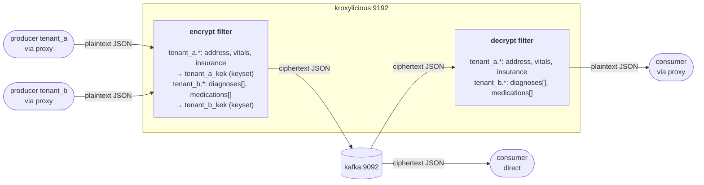

# Demo Scenario 6

Two healthcare providers — `tenant_a` and `tenant_b` — stream fictional patient health records to separate Kafka topics. Each tenant requires a distinct set of fields to be encrypted and uses its own dedicated KEK (Key Encryption Key) keyset. This demo shows how the proxy filter supports per-topic-pattern field configurations and per-field keyset references, enabling true tenant isolation in a shared Kafka cluster without any changes to the producers or consumers.

---

## Scenario Overview

The stack is intentionally minimal: a single Kafka broker and a single Kroxylicious proxy instance. No schema registry is required. The records are plain JSON, so both filters are configured with `record_format: JSON`.

| Container      | Image                                      | Role                                        |
| -------------- | ------------------------------------------ | ------------------------------------------- |
| `kafka`        | `quay.io/strimzi/kafka:0.51.0-kafka-4.2.0` | KRaft-mode single-node Kafka broker         |
| `kroxylicious` | `hpgrahsl/kroxy-k4k-filter:beta8`          | Kroxylicious proxy (0.20.0) with k4k filter |

### Data Flow



**Key insight:** Two topic-pattern rules, two separate keysets, and two different field selection strategies (whole-field vs. array-element) all coexist in a single proxy filter deployment. Each tenant's data is encrypted under its own KEK keyset and only the fields relevant to that tenant are touched.

---

## Proxy Configuration

The proxy configuration for this demo scenario is in [proxy_config.yaml](proxy_config.yaml).

### Virtual Cluster

Kroxylicious exposes a virtual cluster (`demo-cluster`) that forwards all traffic to the real broker at `kafka:9092`. Clients connect to `kroxylicious:9192`.

### Filter Chain

Both the encryption and decryption filters are active as default filters on all traffic:

```yaml
defaultFilters:
  - k4k-encrypt
  - k4k-decrypt
```

- **Produce path**: records pass through the encryption filter; selected field values are encrypted and replaced with ciphertext before being written to Kafka.
- **Fetch path**: records pass through the decryption filter; ciphertext for selected fields is decrypted and replaced with plaintext before delivery to the client.

### Record Format

Both filters use `record_format: JSON` hence no schema registry is required for this example.

### Key Material

Two Key Encryption Key (KEK) keysets are configured inline (`key_source: CONFIG`), one per tenant:

| Identifier     | Algorithm                      | Primary Key ID | Keys in Keyset            | Used for                         |
| -------------- | ------------------------------ | -------------- | ------------------------- | -------------------------------- |
| `tenant_a_kek` | `TINK/AES_GCM_ENVELOPE_KEYSET` | `10000`        | `10000`, `10001`, `10002` | `address`, `vitals`, `insurance` |
| `tenant_b_kek` | `TINK/AES_GCM_ENVELOPE_KEYSET` | `10003`        | `10003`, `10004`, `10005` | `diagnoses`, `medications`       |

- Learn more about [keyset-based envelope encryption](https://hpgrahsl.github.io/kryptonite-for-kafka/dev/envelope-encryption/#keyset-based-envelope-encryption) here.

- You can find more information about [keyset management](https://hpgrahsl.github.io/kryptonite-for-kafka/dev/key-management/) and the [keyset tool](https://hpgrahsl.github.io/kryptonite-for-kafka/dev/keyset-tool/) in the Kryptonite for Kafka documentation.

### Topic Field Configuration

The filter applies separate rules for each tenant topic namespace:

```yaml
topic_field_configs:
  - topic_pattern: tenant_a.*
    field_configs:
      - name: address
        keyId: tenant_a_kek
      - name: vitals
        keyId: tenant_a_kek
      - name: insurance
        keyId: tenant_a_kek
  - topic_pattern: tenant_b.*
    field_configs:
      - name: diagnoses
        fieldMode: ELEMENT
        keyId: tenant_b_kek
      - name: medications
        fieldMode: ELEMENT
        keyId: tenant_b_kek
```

| Tenant     | Field         | `fieldMode`        | `keyId`        | Notes                                                                     |
| ---------- | ------------- | ------------------ | -------------- | ------------------------------------------------------------------------- |
| `tenant_a` | `address`     | `OBJECT` (default) | `tenant_a_kek` | Entire JSON object is encrypted as a single ciphertext string             |
| `tenant_a` | `vitals`      | `OBJECT` (default) | `tenant_a_kek` | Entire JSON object is encrypted as a single ciphertext string             |
| `tenant_a` | `insurance`   | `OBJECT` (default) | `tenant_a_kek` | Entire JSON object is encrypted as a single ciphertext string             |
| `tenant_b` | `diagnoses`   | `ELEMENT`          | `tenant_b_kek` | Each array element is encrypted individually; array structure is retained |
| `tenant_b` | `medications` | `ELEMENT`          | `tenant_b_kek` | Each array element is encrypted individually; array structure is retained |

Fields not listed in the configuration are always passed through unchanged.

---

## Spotlight: Tenant Isolation via Per-Pattern Keyset Binding

The two `topic_field_configs` entries show how a single proxy deployment handles multiple tenants cleanly:

- **Separate KEK keysets** — `tenant_a_kek` and `tenant_b_kek` are completely independent Tink keysets. A consumer (or dedicated proxy instance for that matter) would only hold `tenant_b_kek` cannot decrypt `tenant_a` data, despite full Kafka ACL access to both topics.
- **Different field sets per tenant** — `tenant_a` encrypts three whole-object fields (`address`, `vitals`, `insurance`) to protect PII and clinical data at the structural level. `tenant_b` encrypts individual array elements within `diagnoses` and `medications`, preserving the array container itself while hiding each entry.
- **`fieldMode: ELEMENT`** — when set, the filter iterates the JSON array and encrypts every element in place. The resulting array keeps its length and structure, so downstream consumers that only inspect the array shape do not need key access and could still infer certain facts: "How many diagnoses are known for a patient?", or "What is the number of medications for a patient?".

---

## Example: What Gets Encrypted

### Tenant A — Input Record (plaintext)

```json
{
  "patient_id": "TENANT_A-00001",
  "tenant": "tenant_a",
  "first_name": "James",
  "last_name": "Rodriguez",
  "date_of_birth": "1961-12-20",
  "age": 64,
  "gender": "M",
  "email": "james.rodriguez65@gmail.com",
  "phone": "(774) 403-9928",
  "address": {
    "street": "6973 Maple Dr",
    "city": "Georgetown",
    "state": "CA",
    "zip": "30926"
  },
  "insurance": {
    "plan": "Humana Plus",
    "member_id": "MBR456778",
    "group_number": "GRP5552"
  },
  "vitals": {
    "height_cm": 160,
    "weight_kg": 67.5,
    "bmi": 26.4,
    "blood_pressure": "109/73",
    "heart_rate_bpm": 103,
    "spo2_pct": 96.0,
    "temperature_c": 36.3
  },
  "diagnoses": [
    {
      "description": "Obesity",
      "icd10_code": "E66.9",
      "onset_date": "2012-03-03"
    },
    {
      "description": "Hyperlipidemia",
      "icd10_code": "E78.5",
      "onset_date": "2018-01-19"
    }
  ],
  "medications": [
    {
      "name": "Atorvastatin",
      "dosage_mg": 100,
      "frequency": "as needed",
      "prescribed_date": "2024-07-10"
    },
    {
      "name": "Warfarin",
      "dosage_mg": 5,
      "frequency": "every 8 hours",
      "prescribed_date": "2023-01-03"
    },
    {
      "name": "Pantoprazole",
      "dosage_mg": 10,
      "frequency": "every 8 hours",
      "prescribed_date": "2020-06-10"
    },
    {
      "name": "Metformin",
      "dosage_mg": 50,
      "frequency": "as needed",
      "prescribed_date": "2023-03-28"
    },
    {
      "name": "Lisinopril",
      "dosage_mg": 25,
      "frequency": "once daily",
      "prescribed_date": "2020-04-03"
    }
  ],
  "last_visit": "2025-09-16",
  "next_appointment": "2023-04-12",
  "attending_physician": "Dr. Martinez, MD",
  "department": "Orthopedics",
  "notes": "Follow-up labs ordered."
}
```

### Tenant A — Encrypted Record (stored in Kafka / seen by direct consumer)

The three whole-object fields are each replaced by a single base64 ciphertext string. Fields like `diagnoses` and `medications` are stored in plaintext because they are not part of the `tenant_a.*` field configuration:

```json
{
  "patient_id": "TENANT_A-00001",
  "tenant": "tenant_a",
  "first_name": "James",
  "last_name": "Rodriguez",
  "date_of_birth": "1961-12-20",
  "age": 64,
  "gender": "M",
  "email": "james.rodriguez65@gmail.com",
  "phone": "(774) 403-9928",
  "address": "azIwMDA1DHRlbmFudF9hX2tlawAAADEBAAAnEPevxlKwhGO0ZrrGbp28AFEcqteid7EP4RtwjR+lBuz+wEwQIt5BopF88+coTUdg/RC6hmyVZJaoNbYAIud0ZamdbX/ufIvVNPvo1p15W/NQ7u+sSIZAaA+M8H2tzI6VaBAWy3iyNBie4uQzBpafS8bNpG1SnllTX/H7LYujuHP4ogA=",
  "insurance": "azIwMDA1DHRlbmFudF9hX2tlawAAADEBAAAnEPevxlKwhGO0ZrrGbp28AFEcqteid7EP4RtwjR+lBuz+wEwQIt5BopF88+co2iW8WeEPFjGpV/KNDZCRgs3FHBxJiT+/FrebAglkpcEuFaE1CjokDawh4Nue4RJSIzOSdiW8s5pTc1sqJggt1fwBiwSYkoIMDc5A7cLG0xH3qKF1f0mv2w==",
  "vitals": "azIwMDA1DHRlbmFudF9hX2tlawAAADEBAAAnEPevxlKwhGO0ZrrGbp28AFEcqteid7EP4RtwjR+lBuz+wEwQIt5BopF88+cooR+PtJKk41EESAaFWKRjbGYny/kzFqSSDdptz6LrKUYfhcY/9C2TFo5N4A7zAD3KuC2IGwMtI43oJEmSJQKD8bPBjjSu/+4Cq8AQd+LHv3wJY4YgGR+Hiv7gKYUfuN7v3bVRCG9TlgiPh4esX6osfpQ0XIN0ue1J2ecrBP/1BjOFJAVHCCmKGBD18jONocwgm7aAWW0CJiaocfKV",
  "diagnoses": [
    {
      "description": "Obesity",
      "icd10_code": "E66.9",
      "onset_date": "2012-03-03"
    },
    {
      "description": "Hyperlipidemia",
      "icd10_code": "E78.5",
      "onset_date": "2018-01-19"
    }
  ],
  "medications": [
    {
      "name": "Atorvastatin",
      "dosage_mg": 100,
      "frequency": "as needed",
      "prescribed_date": "2024-07-10"
    },
    {
      "name": "Warfarin",
      "dosage_mg": 5,
      "frequency": "every 8 hours",
      "prescribed_date": "2023-01-03"
    },
    {
      "name": "Pantoprazole",
      "dosage_mg": 10,
      "frequency": "every 8 hours",
      "prescribed_date": "2020-06-10"
    },
    {
      "name": "Metformin",
      "dosage_mg": 50,
      "frequency": "as needed",
      "prescribed_date": "2023-03-28"
    },
    {
      "name": "Lisinopril",
      "dosage_mg": 25,
      "frequency": "once daily",
      "prescribed_date": "2020-04-03"
    }
  ],
  "last_visit": "2025-09-16",
  "next_appointment": "2023-04-12",
  "attending_physician": "Dr. Martinez, MD",
  "department": "Orthopedics",
  "notes": "Follow-up labs ordered."
}
```

---

### Tenant B — Input Record (plaintext)

```json
{
  "patient_id": "TENANT_B-00001",
  "tenant": "tenant_b",
  "first_name": "Betty",
  "last_name": "Miller",
  "date_of_birth": "1993-10-11",
  "age": 32,
  "gender": "F",
  "email": "betty.miller90@gmail.com",
  "phone": "(838) 701-4268",
  "address": {
    "street": "7008 Elm Ln",
    "city": "Madison",
    "state": "OH",
    "zip": "60870"
  },
  "insurance": {
    "plan": "Cigna Select",
    "member_id": "MBR259673",
    "group_number": "GRP8560"
  },
  "vitals": {
    "height_cm": 179,
    "weight_kg": 92.5,
    "bmi": 28.9,
    "blood_pressure": "142/71",
    "heart_rate_bpm": 91,
    "spo2_pct": 96.0,
    "temperature_c": 37.7
  },
  "diagnoses": [
    {
      "description": "Hypothyroidism",
      "icd10_code": "E03.9",
      "onset_date": "2021-11-10"
    },
    {
      "description": "Rheumatoid Arthritis",
      "icd10_code": "M06.9",
      "onset_date": "2011-12-21"
    }
  ],
  "medications": [
    {
      "name": "Atorvastatin",
      "dosage_mg": 500,
      "frequency": "as needed",
      "prescribed_date": "2022-04-04"
    },
    {
      "name": "Gabapentin",
      "dosage_mg": 5,
      "frequency": "as needed",
      "prescribed_date": "2023-02-16"
    }
  ],
  "last_visit": "2022-01-16",
  "next_appointment": "2024-05-20",
  "attending_physician": "Dr. Miller, DO",
  "department": "Neurology",
  "notes": "Patient compliant with medication regimen."
}
```

### Tenant B — Encrypted Record (stored in Kafka / seen by direct consumer)

Each array element in `diagnoses` and `medications` is individually replaced by a ciphertext string. The arrays themselves remain intact. Fields like `address` and `insurance` are stored in plaintext because they are not part of the `tenant_b.*` field configuration:

```json
{
  "patient_id": "TENANT_B-00001",
  "tenant": "tenant_b",
  "first_name": "Betty",
  "last_name": "Miller",
  "date_of_birth": "1993-10-11",
  "age": 32,
  "gender": "F",
  "email": "betty.miller90@gmail.com",
  "phone": "(838) 701-4268",
  "address": {
    "street": "7008 Elm Ln",
    "city": "Madison",
    "state": "OH",
    "zip": "60870"
  },
  "insurance": {
    "plan": "Cigna Select",
    "member_id": "MBR259673",
    "group_number": "GRP8560"
  },
  "vitals": {
    "height_cm": 179,
    "weight_kg": 92.5,
    "bmi": 28.9,
    "blood_pressure": "142/71",
    "heart_rate_bpm": 91,
    "spo2_pct": 96.0,
    "temperature_c": 37.7
  },
  "diagnoses": [
    "azIwMDA1DHRlbmFudF9iX2tlawAAADEBAAAnE+OlmJPGfKCtl4CDuq5z0fBKOK+ekjhqywN1vc33A82WYmCApaOmIX6aRzpyaEeKNn9MRXRtejkCClspZ8o9eH3SuftRs6dlu+bYPsZzlB37Z5U6pW+7/ri+nA84BLYkuoSigLOOpZ0bVR+71R7c3xe6U1WGbaP+kDd9FTqEEpzXSFw2cXOv7tAjOAam",
    "azIwMDA1DHRlbmFudF9iX2tlawAAADEBAAAnE+OlmJPGfKCtl4CDuq5z0fBKOK+ekjhqywN1vc33A82WYmCApaOmIX6aRzpyJ3vf4YZaRhd7ynUy43BSN7UopFRBW5HgklyPYL+KlziICBUsDbyxZ/Php/yS8agLS4Gi4rS5kOgdJnNMbo5sgDMd7p9lH6bgJ1m7Hy8SzfwCkx5JBlAQUMu2rzq9lRx2Mi0FJpOn"
  ],
  "medications": [
    "azIwMDA1DHRlbmFudF9iX2tlawAAADEBAAAnE+OlmJPGfKCtl4CDuq5z0fBKOK+ekjhqywN1vc33A82WYmCApaOmIX6aRzpypbZmvaOca+3RVI4x6KbcRpKEn91dBEvwR93D5oQ3nWhZqrwKK9zZYw4iCTKPpDORtpVQxDiRoomBg842J7lyQlMDJnlrxUiUOIXXQLs06nMYp73Cp5BmJCfHEb+G9LtJHHvOR7Rld95klvb2",
    "azIwMDA1DHRlbmFudF9iX2tlawAAADEBAAAnE+OlmJPGfKCtl4CDuq5z0fBKOK+ekjhqywN1vc33A82WYmCApaOmIX6aRzpyB8Eahr1xsVilNM9Z9tAjAhwKia7xEEXWKjBnbUMaRygNaHh8N4WLUxnrh7VtUec7seJfbatiSmWuitdUY8x5K2uv8rWJ3bLQniIugPuUpyp0ALftHPVtw83sI1cklZTFiVLpSNK2Dkrd"
  ],
  "last_visit": "2022-01-16",
  "next_appointment": "2024-05-20",
  "attending_physician": "Dr. Miller, DO",
  "department": "Neurology",
  "notes": "Patient compliant with medication regimen."
}
```

---

## Running the Demo

Run all the following commands from within the `./scenario_06/` folder.

### 1. Start the Stack

```bash
docker compose up -d
```

Wait a few seconds for Kafka and Kroxylicious to be fully ready.

---

### 2. Produce Tenant A Records via the Proxy (encrypted write)

The sample data for `tenant_a` consists of 100 patient health records mounted at `/home/kafka/data/` inside the Kafka container.

```bash
docker exec kafka /home/kafka/scripts/produce_proxy.sh /home/kafka/data/tenant_a_health_records.jsonl tenant_a.health_records
```

The proxy intercepts each record, detects that the topic matches `tenant_a.*`, and encrypts the `address`, `vitals`, and `insurance` fields using `tenant_a_kek` before forwarding to the broker.

---

### 3. Produce Tenant B Records via the Proxy (encrypted write)

```bash
docker exec kafka /home/kafka/scripts/produce_proxy.sh /home/kafka/data/tenant_b_health_records.jsonl tenant_b.health_records
```

The proxy intercepts each record, detects that the topic matches `tenant_b.*`, and encrypts every element within the `diagnoses` and `medications` arrays using `tenant_b_kek` before forwarding to the broker.

---

### 4. Consume Directly from Kafka (see ciphertext)

Bypass the proxy to confirm that encrypted field data is stored in Kafka and is not readable without key access.

**Tenant A** (fields `address`, `vitals`, `insurance` are ciphertext):

```bash
docker exec -it kafka /home/kafka/scripts/consume.sh 100 tenant_a.health_records kafka:9092
```

**Tenant B** (every `diagnoses` and `medications` array element is ciphertext):

```bash
docker exec -it kafka /home/kafka/scripts/consume.sh 100 tenant_b.health_records kafka:9092
```

---

### 5. Consume via the Proxy (see plaintext)

Connect through Kroxylicious to confirm that the decryption filter transparently restores all encrypted fields to their original plaintext values.

**Tenant A**:

```bash
docker exec -it kafka /home/kafka/scripts/consume.sh 100 tenant_a.health_records kroxylicious:9192
```

**Tenant B**:

```bash
docker exec -it kafka /home/kafka/scripts/consume.sh 100 tenant_b.health_records kroxylicious:9192
```

The output for each tenant should be identical to the original plaintext input produced in steps 2 and 3.

---

### 6. Shut Down

```bash
docker compose down
```
