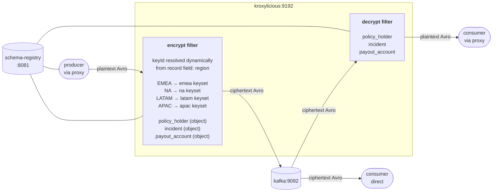

# Demo Scenario 7

Insurance claim events in AVRO format are published to a Kafka topic. Each claim record carries a `region` field with one of four values (`EMEA`, `LATAM`, `APAC`, `NA`) representing the origin region of the claim. The proxy filter reads that field at runtime and selects the matching regional keyset automatically, so every record is encrypted under the key that belongs to its region: one topic, one rule, regional keys resolved dynamically from the record itself.

---

## Scenario Overview

The stack consists of three containers:

| Container         | Image                                            | Role                                        |
| ----------------- | ------------------------------------------------ | ------------------------------------------- |
| `kafka`           | `quay.io/strimzi/kafka:0.51.0-kafka-4.2.0`      | KRaft-mode single-node Kafka broker         |
| `schema-registry` | `confluentinc/cp-schema-registry:8.2.0`          | Confluent Schema Registry for Avro          |
| `kroxylicious`    | `hpgrahsl/kroxylicious-kryptonite:0.20.0-0.1.0` | Kroxylicious proxy (0.20.0) with k4k filter |

### Data Flow



**Key insight:** All records share a single topic and a single filter rule. The keyset used to encrypt each record is determined solely by the value of the `region` field inside that record. This means that any ciphertext is cryptographically fully isolated across regions.

---

## Proxy Configuration

The proxy configuration for this demo scenario is in [proxy_config.yaml](proxy_config.yaml).

### Virtual Cluster

Kroxylicious exposes a virtual cluster (`demo-cluster`) that forwards all traffic to the real broker at `kafka:9092`. Clients connect to `kroxylicious:9192`.

### Filter Chain

Both the encryption and decryption filters are active as default filters on all traffic:

```yaml
defaultFilters:
  - k4k-encrypt
  - k4k-decrypt
```

- **Produce path**: records pass through the encryption filter; the three sensitive composite fields are encrypted with the keyset resolved from the record's `region` field before being written to Kafka.
- **Fetch path**: records pass through the decryption filter; the ciphertext for those fields is decrypted and replaced with plaintext before delivery to the client.

### Record Format

Filters are configured with `record_format: AVRO` (schema registry URL is `http://schema-registry:8081`). The schema mode is `DYNAMIC`, meaning the filter performs all necessary schema mutations on the fly as required by the configured field settings.

### Key Material

Five keysets are configured inline (`key_source: CONFIG`), one per region plus a default one that could be used for other purposes:

| Keyset Identifier    | Cipher Algorithm                      | Primary Key ID | used when `region` equals |
| ------------- | ------------------------------ | -------------- | ------------------------- |
| `EMEA`        | `TINK/AES_GCM_ENVELOPE_KEYSET` | `100001`       | `"EMEA"`                  |
| `NA`          | `TINK/AES_GCM_ENVELOPE_KEYSET` | `100002`       | `"NA"`                    |
| `LATAM`       | `TINK/AES_GCM_ENVELOPE_KEYSET` | `100003`       | `"LATAM"`                 |
| `APAC`        | `TINK/AES_GCM_ENVELOPE_KEYSET` | `100004`       | `"APAC"`                  |

You can find more information about [keyset management](https://hpgrahsl.github.io/kryptonite-for-kafka/dev/key-management/), the [keyset tool](https://hpgrahsl.github.io/kryptonite-for-kafka/dev/keyset-tool/), and [envelope encryption](https://hpgrahsl.github.io/kryptonite-for-kafka/dev/envelope-encryption/) in the Kryptonite for Kafka documentation.

### Topic Field Configuration

The filter applies to the `insurance-claims` topic:

```yaml
topic_field_configs:
  - topic_pattern: insurance-claims
    field_configs:
      - name: policy_holder
      - name: incident
      - name: payout_account
```

| Field           | Type   | Encrypted as | Notes                                                    |
| --------------- | ------ | ------------ | -------------------------------------------------------- |
| `policy_holder` | object | single ciphertext string | PII: name, DOB, email, phone, national ID  |
| `incident`      | object | single ciphertext string | Sensitive claim details including location |
| `payout_account`| object | single ciphertext string | Financial: bank, IBAN/account, routing code|

All other fields (`claim_id`, `submitted_at_utc`, `region`, `policy_id`, `policy_type`, `claimed_amount`, `currency`, `status`, `adjuster_id`, `supporting_documents`) are passed through unchanged.

---

## Spotlight: Dynamic Key Identifiers

This is the defining feature of this scenario. In all previous scenarios the `keyId` for each field is a static string written directly into the filter config. Here, the key identifier is resolved at runtime from the record being processed.

The two relevant config properties are:

```yaml
cipher_data_key_identifier: '$$:region'
dynamic_key_id_prefix: '$$:'
```

The `dynamic_key_id_prefix` value (`$$:`) tells the filter that any `cipher_data_key_identifier` starting with that prefix is not a literal keyset name but a field reference. The remainder of the string (`region`) is the field name to read from the record. At produce time the filter:

1. Reads the value of the `region` field from the incoming record.
2. Uses that value as the keyset identifier to look up in `cipher_data_keys`.
3. Encrypts the configured fields using the matched keyset.

On the consume path the ciphertext is self-describing as the keyset identifier is embedded in the ciphertext header. This means the decrypt filter resolves the correct regional keyset automatically without any additional configuration.

**Why this matters:** Data sovereignty regulations require PII and sensitive claim data to be encrypted under region-controlled keys. With static key identifiers the proxy would need one topic-pattern rule per region, forcing separate topics or complex routing. Dynamic key identifiers collapse the entire multi-region policy into a single field reference, keeping the config simple and making the encryption boundary self-describing.

---

## Example: What Gets Encrypted

### Input Record (plaintext)

```json
{
  "claim_id": "CLM-00001",
  "submitted_at_utc": "2024-05-11T18:12:00Z",
  "region": "EMEA",
  "policy_id": "POL-854717",
  "policy_type": "AUTO",
  "policy_holder": {
    "customer_id": "CUST-49363",
    "full_name": "Henrik Andersen",
    "date_of_birth": "1995-07-01",
    "email": "henrik.andersen@example.eu",
    "phone": "+40-782-7851696",
    "national_id": "EU-9580255"
  },
  "incident": {
    "incident_date": "2024-04-28",
    "incident_type": "WEATHER_DAMAGE",
    "description": "During an overnight period of exceptionally high winds, a mature tree in the street adjacent to where the policyholder's vehicle was parked shed a large primary branch that fell directly onto the roof of the vehicle. The impact caused severe structural deformation of the roof panel, cracked the front windscreen, shattered the rear window, and bent the A-pillar on the driver's side. The vehicle's interior was exposed to further weather damage before the branch could be safely removed the following morning. An assessor confirmed that the vehicle has sustained damage beyond economic repair and a total loss evaluation has been initiated. The policyholder had no ability to anticipate or prevent the incident.",
    "location": {
      "address": "Rua Augusta 130",
      "city": "Lisbon",
      "country": "PT"
    }
  },
  "claimed_amount": 20750.44,
  "currency": "EUR",
  "payout_account": {
    "bank_name": "SEB",
    "account_holder": "Henrik Andersen",
    "iban_or_account_number": "PT8927960401527867283",
    "routing_code": "ESSESESS"
  },
  "status": "APPROVED",
  "adjuster_id": { "string": "ADJ-1027" },
  "supporting_documents": ["DOC-57739-prescription", "DOC-19171-certificate"]
}
```

### Encrypted Record (stored in Kafka / seen by direct consumer)

The filter reads `region: "EMEA"`, selects the `EMEA` keyset, and encrypts the three sensitive composite fields. Every other field is stored in plaintext exactly as produced:

```json
{
    "claim_id": "CLM-00001",
    "submitted_at_utc": "2024-05-11T18:12:00Z",
    "region": "EMEA",
    "policy_id": "POL-854717",
    "policy_type": "AUTO",
    "policy_holder": "azIwMTA1BEVNRUEAAAAxAQABhqFGaxNswqx9ISQzWzeXkWgbFd6I19rX0Yk1ur8yhiGbbOR+uzE4jNPkIZEK58iXQiqv4EgMgqupays8QTflMn7mETcFkplZz4q5jFNqb+pNB6RC+9B46olxKI+BpRFxkt7GISvwnM/5osXob6mBKPcY4lFP90IeEwqP+/y+0SKi9A5LpkVAPc2iJj97VXjDrYCLF45LZjZvdEcYQC8VwSuqgAOQlIJki+qP7icMR04JWvC8UeHabayB2DE09GlxaFdTqvk995iyqSk1Q+GiIO4gJ+9mmnNIgIQUrakI4MmfliZH/+UqFRevkJaoCCFcZlQ48BfkocdQegqCmA8GfOS+gH8bLC7Ev4gpowDmo58PbiBmjGCU+LRvkRxI5Hm25mr+EJS62UZpZGi8Q7xKxrAFh+5MzHUvTXN6+87f9U+OE32rp6GDfy3o9KT6dbCX4ra1g0SKGE6wNlREflf4T6IDpFArSeuLTBY0RHrhoajAW/0MtsySwxTMSDsylU1slPNKO1fOiZPtLK67NZpo08XwFELiFYRJrxDnSzRx3fWNttTj142n3VtvKAbHoHBROq6im0dbrdOi4+SSKQOnjVjChVHNeyexLiSa8LN11dMiyxFOto6yfEwYe3CpUMXA8tdjB5M5",
    "incident": "azIwMTA1BEVNRUEAAAAxAQABhqFGaxNswqx9ISQzWzeXkWgbFd6I19rX0Yk1ur8yhiGbbOR+uzE4jNPkIZEK50quPUbBoQ4r7jux5RFRVmRiFn75W3GWrNm6WYoK3aUrlvX1CWamjpXTDQlcqI+hd5LgUm4cIMBeczi6i3u65vpNiIS76U19QzRudEAcvd0LAP6Co2i31yY5dddSEGOJ2/dC52jzJlaRPvi0F0JE2WlStuBpv/clblx4+sekV5BuTjTT99yAy0XEHKqt6vtC4VScIvB6xv4/XQJS1wTysWZIjFfNGe2STCoEE+IQNzLGewlkmyH3QqWCVTeX17PHXFt8oEFqH4/5I3kbK+VXCWG+VCvIybGuPTAm9Kx7jkISfbRcl2gImLEggwpO/F6cZ3Yt2LmzHXL6SXVkNvkUZTR2oHb4iAm5RXmkRJfb9PjUNzl3IBZQp/XgbWPIwWxYTO88ulWTcHtJSBggkEYAU8rXpTaLu9+2tRKnztjMUpTXCKvTDwj2RQgoGec6LTUBmlmzmHEnrd8sJntvtV5K/yRz+MwQetQjL15hlXXBaFzwA5sYBUlT4r3CtjWmgbquDj9hruYTnmCZTOBChIzqI8HfENJV2Gz3lxBawZD49GcZj+hma3c8suSDKLIbaPfx7bJlQ9dpTnHRTaYmQoO5C+1pxCwmCx7cPuo1v6xlpl01IaBcone1I0fhfBiX/HT2T/xMnKNXDp2wiZ7BFdBAxMMwnJ4HeuVAxqFcBDBKGR+QYqs64mVlmvZ+9iu9xFl9I0TNgNV9dGkAL7kx81K6hzJ4f0rkc83GS46avXIJV5NF6uRzC8HsVUVo6kSG2FJa0rvIhhtmN4Bc1Y0tJD9WIgKGFUL92QSYcvw0YQ0FWUQdDC72J7TuYpwVfv/Fn9Zp9OSyY0tuolgXNO3KeKYAEWu6GF/bMS5J3q1L0O9ELo8d/p0CtSz05AjWshDPuWSvqkVFjSqJPljMuRMFq91GAroTS8o5PfX0eTcX/8E6d62KogdWydi6Jx17KCRHT0cVIAQ85rlNGp5Hs0gowbo3rT28EbqSin+HGtmcQwZNPULbhAvzFqbx1CVWq0ggq8udNRknbOC7pEsLHT1Yx9f5bxM4ny7EGqqdDKu66bb/dGgO8ha76xa+RZ7J6SwS+krBoXq3VEzg1J+iKAd8x7K+kIKRDl7RFCAA6lKi0YajzmTyS9Q206zhuOQ6oIw/theNZXlmMTOi11ZM+ZlwppWFI/1t4CtXo+GOfivjHDiZyCXaxSALMpit+bS4WZbIDaoipVFeiUgr7glmPGetClBIwxYQof3VPTXxaBiyTQST3FrJXHJyvM5e79Ai/04LZhilRur0ulP+SPej7TMVhsdHj7cPHXwUVsDhH02aKYh4kBLxXtTP3BvwYr2CooG4fs7HL8+UE9LVN37bF73JnmVZBLrYYDIL4+hyLubA7WF5znkk39YP23A0rrleMXsVXkhgPCLni0pVA2zHZC0nMKp7GzvOD000VXWHiAmxeGdY01kZ62Qv37xcPcMKlumN2MYvBP+lcRXkkp7DKZ0YopkmzZ+i6cigftrCXjI/mNsnAAV9VJpyr8Bu8eL/rYg74cejPiYBI6lfNQgg2c1qQrumHAvjmdbbmF8pqk2h9rA5/HsBoRDJHnUM2XwGq+PnF/Z/k5qg4ltGjn2yupDYD8XUtFZ+ujNJdGUw9owlOkcEmX8/Palh6lvmaegVf6OeOc5OQXV0qWdheT4QMZQx8s5ICYSQoJmluksx9dniCtnsWDmSZ/EpPPdAQOE9D3Ie+NJHg/SuxcBkdhfPRqRqi2srULn254l1Ys1UtBEt9szhxB+lTBW0maRAV0Wn2GIuTlJjzAlReI4hxSC+9SSWGWfGPDYJ9tpG4Xwvig6CQRpwqEYZijN4rckyP5Y9BphruyHJ4BsS5nv+CBOlOLuQtyzXGIV1F7vsurYq8oTgf1Udjt4=",
    "claimed_amount": 20750.44,
    "currency": "EUR",
    "payout_account": "azIwMTA1BEVNRUEAAAAxAQABhqFGaxNswqx9ISQzWzeXkWgbFd6I19rX0Yk1ur8yhiGbbOR+uzE4jNPkIZEK5yWBXfpsG67ISGM5EH2jnsAapgxTDiYS2HC1/fTzSoLqrcCn6/WMRcNduJMHhOPsqHRYNmOnoW+XKs2vo2DNbOI0SvK5ySiUYTNQ3XNNC2VPuLDbZKbkJX4GtzNV9R1Q/qV4R+h9Sm+B5cipmj2bYs93+9s17ShQGdoYCMvR34fJw0q8DRMDQbJ0VtdX/BGDRHjsr/As89CnBxbROOMaZoMUC9cpJR3TM02Y+U1b7vDDHmdnFQhdgiJCT5gQ+uTdGTyIjPYoVwjIp9ssHKCzwQEtDwcvORTc/iGFer0J5e9TpFkneS030j6e5WB9tF1RxOEXkRv4reZvwbXiiBaeqNsHHAqJo3zZQt0wB2WXvoI1UmoRaFLqpJ7MD9iEwxTYMvA5Ab3kpuyaRgipPNtW4DSlmYKq1G6z3qtSFnTBuQhPOtevjFA5ePcwIzXeLr6J991ogBna2Ct+eUjl",
    "status": "APPROVED",
    "adjuster_id": {
        "string": "ADJ-1027"
    },
    "supporting_documents": [
        "DOC-57739-prescription",
        "DOC-19171-certificate"
    ]
}
```

Field by field:

- **`policy_holder`:** the entire nested object including name, date of birth, email, phone, and national ID is serialised and encrypted as a single ciphertext string under the `EMEA` keyset. Nothing about the policyholder is visible to a direct consumer.
- **`incident`:** the entire incident record including the full description, incident type, and exact location is encrypted as a single ciphertext string. The nature, circumstances, and location of the claim are completely hidden.
- **`payout_account`:** bank name, account holder, IBAN/account number, and routing code are encrypted together as a single ciphertext string. No financial routing details are exposed in the broker.
- All remaining fields are stored in plaintext. Operational fields like `claim_id`, `status`, `claimed_amount`, and `region` remain readable to any consumer, enabling routing, monitoring, and aggregation without requiring key access.

---

## Running the Demo

Run all the following commands from within the `./scenario_07/` directory.

### 1. Start the stack

```bash
docker compose up -d
```

This starts Kafka, Schema Registry, and Kroxylicious. Wait a few seconds for all services to be fully ready.

---

### 2. Produce records via the proxy (encrypted write)

The schema registry container includes the Confluent Kafka CLI tools. The sample data (`insurance_claims.jsonl`) and Avro schema (`insurance_claim.avsc`) are mounted at `/home/appuser/data/`.

```bash
docker exec schema-registry /home/appuser/scripts/proxy_producer.sh
```

The producer connects to Kroxylicious at `kroxylicious:9192` and ingests 500 Avro-encoded insurance claim records using `kafka-avro-console-producer`. The encryption filter intercepts each record, reads the `region` field, selects the matching regional keyset, and encrypts `policy_holder`, `incident`, and `payout_account` before forwarding the record to the broker. Records from all four regions flow into the single `insurance-claims` topic, each encrypted under its own regional key.

---

### 3. Consume directly from the broker (see ciphertext)

```bash
docker exec -it schema-registry /home/appuser/scripts/direct_consumer.sh
```

This bypasses the proxy and connects directly to `kafka:9092`. You will see records exactly as stored in Kafka: `policy_holder`, `incident`, and `payout_account` are all base64 ciphertext strings. Operational fields remain readable. The ciphertext for an EMEA record and an APAC record will differ in their embedded key identifier prefix, reflecting that different keysets were used. Neither can be decrypted without the corresponding regional keyset.

---

### 4. Consume via the proxy (see plaintext)

```bash
docker exec -it schema-registry /home/appuser/scripts/proxy_consumer.sh
```

The consumer connects to Kroxylicious at `kroxylicious:9192`. The decryption filter reads the keyset identifier embedded in each ciphertext, locates the matching regional keyset, and transparently decrypts all three encrypted fields before delivering the record to the consumer. The output is identical to the original plaintext input for all 500 records across all four regions.

---

### 5. Shut down

```bash
docker compose down
```

---

## Note on Avro Tooling

This scenario uses `kafka-avro-console-producer` and `kafka-avro-console-consumer`, both available in the `cp-schema-registry` image. The data file (`insurance_claims.jsonl`) is JSON-per-line, the `kafka-avro-console-producer` reads JSON-encoded Avro records from stdin and serialises them against the registered schema, so no binary Avro encoding of the source data is required. The Avro schema (`insurance_claim.avsc`) is passed inline to the producer via the `value.schema` property, which registers it with the schema registry automatically on first use.
